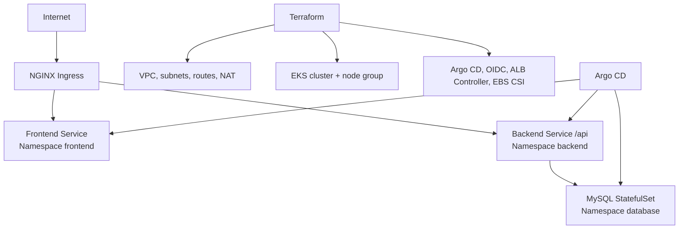

# DevSecOps Project IaC

Repository nay cung cap Infrastructure as Code va Kubernetes manifests cho mot ung dung 3-tier chay tren AWS EKS. Repo tap trung vao viec tao ha tang, cai dat cac add-on can thiet va dong bo ba thanh phan frontend, backend va database qua Argo CD.

## Tong quan



## Chuc nang chinh

### Terraform va AWS

- Tao VPC `10.0.0.0/16` voi public/private subnets tai `ap-southeast-1a` va `ap-southeast-1b`.
- Tao Internet Gateway, NAT Gateway, Elastic IP va route tables cho luong truy cap public/private.
- Tao EKS cluster ten `staging-demo-eks`, Kubernetes version duoc dat trong `terraform/locals.tf`.
- Tao managed node group `general` voi instance `t3.medium`, On-Demand, 2 node mac dinh va co the scale toi 5 node.
- Cau hinh IAM role va policy cho EKS control plane, worker nodes, ECR read-only va Kubernetes add-ons.
- Cau hinh OIDC provider de cac Kubernetes service account co the su dung IAM role thong qua IRSA.
- Cai dat AWS Load Balancer Controller va EBS CSI driver.
- Tao StorageClass Kubernetes `gp2` lam storage class mac dinh.
- Cai Argo CD vao namespace `argocd`, cau hinh server chay insecure phia sau LoadBalancer.

### Kubernetes Helm charts

Ba chart trong thu muc `k8s/` co the duoc deploy doc lap hoac thong qua Argo CD:

- **Frontend**: Deployment, Service ClusterIP, Ingress `/`, HPA tu 1 den 3 replica.
- **Backend**: Deployment, Service ClusterIP tren port `5000`, Ingress `/api`, HPA tu 1 den 3 replica, ConfigMap va Secret ket noi database.
- **Database**: MySQL `8.0` chay bang StatefulSet, Service noi bo, Secret thong tin dang nhap va PersistentVolumeClaim luu tru du lieu.

Argo CD tu dong theo doi nhanh `master`, tu dong sync, prune resource khong con trong Git va self-heal khi cluster bi drift. Moi application tuong ung duoc tao trong namespace rieng: `frontend`, `backend` va `database`.

### Scripts van hanh

Tat ca script nam trong `scripts/` va duoc viet cho Bash:

| Script | Chuc nang |
| --- | --- |
| `connect.sh` | Cap nhat kubeconfig cho EKS va kiem tra node |
| `nginx.sh` | Cai NGINX Ingress Controller bang Helm, dung NodePort HTTP `30080` |
| `argocd.sh` | Port-forward Argo CD toi `localhost:8080` va in mat khau admin ban dau |
| `grafana.sh` | Port-forward Grafana toi `localhost:3000` |
| `prometheus.sh` | Port-forward Prometheus toi `localhost:9090` |
| `start-all.sh` | Cap nhat kubeconfig, cai NGINX va khoi dong cac port-forward o background |

## Cau truc thu muc

```text
terraform/                 AWS infrastructure va Kubernetes add-ons
argocd/applications/       Argo CD Application manifests
k8s/frontend/              Frontend Helm chart
k8s/backend/               Backend Helm chart
k8s/database/              MySQL Helm chart
scripts/                   Script ket noi, cai dat va port-forward
```

## Yeu cau

- AWS CLI da cai dat va da cau hinh credentials co quyen tao EKS, VPC, IAM, ECR va cac tai nguyen lien quan.
- Terraform >= 1.0.
- Helm va `kubectl`.
- Bash shell (Git Bash, WSL hoac Linux). `start-all.sh` su dung `/tmp` va lenh `pkill`.
- Quyền truy cap toi repository Git duoc khai bao trong cac file Argo CD Application.

## Trien khai

### 1. Tao ha tang AWS

```bash
cd terraform
terraform init
terraform validate
terraform plan
terraform apply
```

Mac dinh ha tang dung environment `staging`, region `ap-southeast-1` va cluster `staging-demo-eks`. Cac gia tri nay hien dang dat truc tiep trong `terraform/locals.tf`.

### 2. Ket noi cluster

```bash
cd scripts
./connect.sh
kubectl get nodes
```

### 3. Cai NGINX va khoi tao Argo CD applications

```bash
./nginx.sh
kubectl apply -f ../argocd/applications/
kubectl get applications -n argocd
```

Sau khi sync thanh cong, kiem tra resource:

```bash
kubectl get all -n frontend
kubectl get all -n backend
kubectl get all -n database
kubectl get ingress -A
```

### 4. Mo cac cong cu quan tri

```bash
./argocd.sh
./grafana.sh
./prometheus.sh
```

Truy cap Argo CD tai `http://localhost:8080`, Grafana tai `http://localhost:3000` va Prometheus tai `http://localhost:9090`. `start-all.sh` co the dung de chay cac port-forward nay cung luc.

## Cau hinh quan trong

- Image frontend va backend duoc lay tu AWS ECR trong `k8s/*/values.yaml`; cap nhat `image.tag` khi phat hanh image moi.
- Backend mac dinh ket noi toi `database-service.database.svc.cluster.local`, database `test_db`, port `5000`.
- Frontend va backend co resource requests/limits va HPA theo CPU 50%.
- MySQL mac dinh yeu cau PVC `5Gi`, ReadWriteOnce.
- Ingress frontend dung path `/`; backend dung path `/api` va NGINX rewrite ve `/`.
- Thay doi endpoint Git, branch hoac path deploy trong `argocd/applications/*.yaml` neu su dung repository khac.

## Monitoring

Resource `kube-prometheus-stack` trong `terraform/addons.tf` hien dang bi comment. Do do, Prometheus va Grafana khong duoc Terraform cai tu dong. Hai script tuong ung chi hoat dong sau khi `kube-prometheus-stack` da duoc cai trong namespace `monitoring` va ton tai cac service:

```bash
helm repo add prometheus-community https://prometheus-community.github.io/helm-charts
helm repo update
helm upgrade --install kube-prometheus-stack prometheus-community/kube-prometheus-stack \
  --namespace monitoring --create-namespace
```

## Bao mat va van hanh

- Khong dung mat khau mac dinh trong moi truong production. Cac mat khau trong `values.yaml` hien chi phu hop cho demo va can duoc thay bang Secret manager hoac co che quan ly secret an toan.
- Kiem tra AWS IAM policy, Security Group, ingress exposure va EKS endpoint truoc khi dung production.
- Khong commit `terraform.tfstate`, file `tfvars` hoac secret that. State nen duoc luu trong backend tu xa co encryption va locking.
- Nen pin version cho Helm chart, image va add-on; review `terraform plan` truoc moi lan apply.
- StatefulSet MySQL co PVC nhung repo chua cung cap backup/restore, replication hoac disaster recovery.

## Luu y hien tai

- `k8s/database/values.yaml` khai bao `storageClass: gp3`, nhung template StatefulSet dang su dung cung `gp2` co dinh. Neu muon cau hinh tu values, can cap nhat template truoc khi deploy.
- Argo CD dang tro toi repository Git va branch `master` duoc khai bao trong manifest. Hay dam bao URL/branch nay dung voi noi luu code thuc te.
- Terraform state dang co trong thu muc `terraform/` theo workspace hien tai, nhung `.gitignore` da ngan cac file state moi bi commit. Khong chia se state co chua thong tin nhay cam.

## Don dep tai nguyen

```bash
cd terraform
terraform destroy
```

Chi chay lenh nay sau khi xac nhan chac chan vi no se xoa cluster, network, node group va cac tai nguyen AWS do Terraform quan ly.
