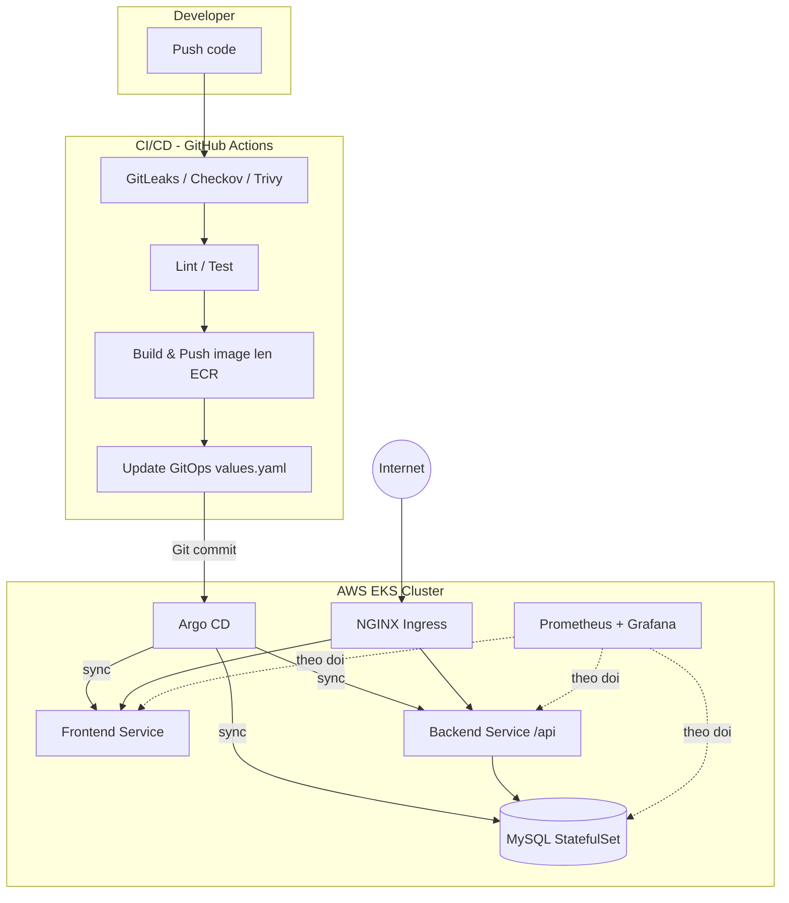

# Tổng quan dự án: 3-Tier User Platform (DevSecOps trên AWS EKS)

## 1. Giới thiệu

**3-Tier User Platform** là dự án portfolio mô phỏng một ứng dụng quản lý người dùng theo mô hình 3 tầng (Presentation – Application – Data), được triển khai theo hướng **DevSecOps** hoàn chỉnh trên **AWS EKS**: từ hạ tầng dưới dạng code (Terraform), đóng gói ứng dụng (Docker/Helm), tự động hóa CI/CD (GitHub Actions), triển khai theo mô hình GitOps (Argo CD), cho đến giám sát hệ thống (Prometheus/Grafana) và kiểm tra bảo mật xuyên suốt pipeline (GitLeaks, Checkov, Trivy).

Dự án gồm 2 repository tách biệt:

| Repository | Vai trò |
| --- | --- |
| `3-tier-user-platform` | Source code ứng dụng (frontend React, backend Node.js/Express, MySQL) + pipeline CI/CD |
| `3-tier-user-platform-iac` | Hạ tầng AWS (Terraform) + Kubernetes manifests (Helm charts) + Argo CD Application |

---

## 2. Kiến trúc tổng thể

**Nguyên lý vận hành:** Developer push code → pipeline CI kiểm tra bảo mật/chất lượng → build & push image lên ECR → pipeline CD cập nhật tag image trong repo IaC → Argo CD phát hiện thay đổi và tự động đồng bộ cluster (GitOps). Toàn bộ cluster được giám sát bởi Prometheus/Grafana và có cảnh báo qua email.

---

## 3. Ứng dụng (3-Tier Application)

| Tầng | Công nghệ | Trách nhiệm |
| --- | --- | --- |
| Presentation | React 17, Webpack, Axios | Hiển thị danh sách người dùng, form tạo mới |
| Application/API | Node.js 18, Express 4, CORS | REST API CRUD người dùng (`/api/users`) |
| Data | MySQL 8 | Lưu bảng `users` (id, name, email, role) |

- Backend tự tạo bảng `users` khi khởi động, không cần migration riêng.
- API hỗ trợ đầy đủ CRUD (`GET`, `POST`, `PUT`, `DELETE`), nhưng giao diện React hiện chỉ nối dây cho hiển thị danh sách và tạo mới — nút Edit/Delete chưa nối handler.
- Chưa có authentication/authorization, validation đầu vào, rate limiting hay health check — là các hạng mục cần bổ sung để sẵn sàng production.

---

## 4. Hạ tầng AWS (Terraform)

- **Network:** VPC `10.0.0.0/16`, public/private subnet tại 2 AZ (`ap-southeast-1a`, `ap-southeast-1b`), Internet Gateway, NAT Gateway, Elastic IP, route table.
- **Compute:** EKS cluster `staging-demo-eks`, managed node group `general` (`t3.medium`, On-Demand, 2–5 node).
- **IAM/Security:** IAM role/policy cho control plane, worker node, ECR read-only; OIDC provider cho IRSA (Kubernetes service account dùng trực tiếp IAM role).
- **Add-ons:** AWS Load Balancer Controller, EBS CSI driver, StorageClass `gp2` mặc định, Argo CD (namespace `argocd`).
- **Module hóa:** Terraform được tổ chức theo layer Networking → EKS Core → IAM/IRSA → Add-ons, giúp tái sử dụng và chuẩn hóa giữa các môi trường.
- **Hiệu quả:** Rút ngắn thời gian provisioning từ vài giờ xuống **dưới 15 phút**.

---

## 5. Kubernetes & GitOps

- Ba Helm chart độc lập trong `k8s/`: **frontend**, **backend**, **database** (MySQL StatefulSet), mỗi chart deploy vào namespace riêng.
- **Argo CD** theo dõi nhánh `master` của repo IaC, tự động sync, prune resource thừa và **self-heal** khi cluster bị drift so với Git — đảm bảo trạng thái cluster luôn khớp với source of truth.
- Frontend/backend có HPA scale 1–3 replica theo CPU 50%.
- Backend kết nối MySQL qua `database-service.database.svc.cluster.local`.
- Ingress: `/` cho frontend, `/api` cho backend (NGINX rewrite về `/`).

---

## 6. CI/CD Pipeline (GitHub Actions)

Pipeline `qa-cicd.yaml` kích hoạt khi push vào nhánh `qa`, gồm 2 giai đoạn:

### CI — Continuous Integration

| Job | Chức năng |
| --- | --- |
| `git-leaks` | Quét secret bị lộ trong code |
| `checkov-docker` | Quét misconfiguration trong Dockerfile |
| `trivy-scan` | Quét lỗ hổng dependency (matrix client/server) |
| `lint-client` / `lint-server` | Kiểm tra coding convention |
| `testcase-client` / `testcase-server` | Chạy unit test |
| `client-build` | Build bundle production frontend |

### CD — Continuous Delivery

| Job | Chức năng |
| --- | --- |
| `docker-backend-build` | Build, scan Trivy, push image backend lên ECR |
| `docker-frontend-build` | Build, scan Trivy, push image frontend lên ECR |
| `update-gitops-manifest` | Cập nhật `image.tag` trong repo IaC (`values.yaml`) bằng `yq`, commit & push — Argo CD tự động sync theo thay đổi này |

- Pipeline dùng **YQ** để cập nhật Helm values, tự động hóa hoàn toàn quá trình release.
- **Hiệu quả:** Giảm thời gian release từ khoảng 30 phút xuống **~5 phút**.
- **Điểm cần lưu ý:** Các bước GitLeaks/Checkov/Trivy hiện chạy với `--exit-code 0` hoặc `|| true` nên chỉ mang tính báo cáo, chưa chặn merge/build khi phát hiện lỗi; lint và test hiện chưa có tác dụng vì `package.json` chưa khai báo script tương ứng; job SonarCloud đang bị comment toàn bộ.

---

## 7. Giám sát & DevSecOps

- **Prometheus + Grafana + Alertmanager**: theo dõi CPU, Memory, Pod Restarts và trạng thái cluster; cảnh báo qua email (Gmail SMTP) để phát hiện sự cố sớm.
- **Trivy, Checkov, GitLeaks** tích hợp xuyên suốt CI/CD: kiểm tra container image, cấu hình Terraform/Kubernetes/Dockerfile và secret trước khi merge/deploy.
- Đã xử lý một số sự cố thực tế trong quá trình vận hành: PVC ở trạng thái Pending do EBS CSI driver IRSA misconfiguration và Terraform state drift; Secret naming mismatch và định dạng Gmail App Password khi cấu hình Alertmanager.

---

## 8. Giới hạn hiện tại & định hướng mở rộng

**Giới hạn:**
- Chưa có authentication/authorization, validation đầu vào, rate limiting cho API.
- Lint/test/SonarCloud chưa hoạt động thực tế do thiếu script và đang bị comment.
- Các bước security scan chưa chặn pipeline khi phát hiện lỗi nghiêm trọng.
- MySQL StatefulSet chưa có backup/restore hoặc replication.
- Thiếu `docker-load-balancer-controller` trong `addons.tf` (đã xác định là gap cần bổ sung).

**Định hướng mở rộng:**
1. Nối đầy đủ chức năng Edit/Delete ở frontend với API.
2. Bổ sung test runner, script `lint`/`test`, bật lại job SonarCloud.
3. Chuyển các bước scan bảo mật sang chế độ fail-fast khi phát hiện lỗi mức CRITICAL.
4. Thêm validation, xử lý lỗi thống nhất, health check cho API.
5. Thêm backup/restore cho MySQL, cân nhắc chuyển sang managed database (RDS) cho môi trường production.

---

## 9. Repositories

- App: `github.com/buicongthanh861/3-tier-user-platform`
- Infrastructure: `github.com/buicongthanh861/3-tier-user-platform-iac`
